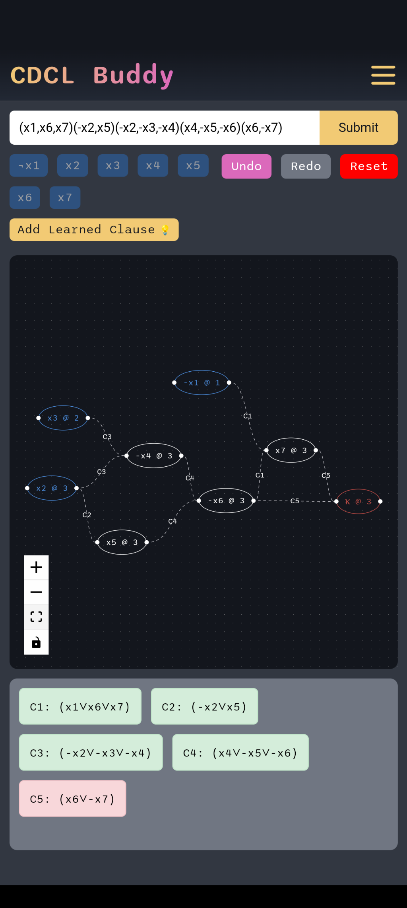

# CDCL Buddy App

Welcome to the **CDCL Buddy App** repository! This project is a React Native application designed as a wrapper for the `cdcl-buddy` tool, which is deployed at [cdclbuddy.com](https://cdclbuddy.com). The purpose of this app is to provide mobile-friendly access to the features and tools available on the website.

For the core tool code, please visit the [cdcl-buddy](https://github.com/yourusername/cdcl-buddy) repository.

## Table of Contents

- [Overview](#overview)
- [Screenshots](#screenshots)
- [Features](#features)
- [Getting Started](#getting-started)
- [Directory Structure](#directory-structure)
- [Dependencies](#dependencies)
- [Contributing](#contributing)
- [License](#license)

---

## Overview

The **CDCL Buddy App** is built using React Native and Expo. Its primary purpose is to serve as a lightweight mobile interface that wraps around the existing website at [cdclbuddy.com](https://cdclbuddy.com). Users can leverage the app for a seamless experience while accessing the CDCL Buddy tool on their mobile devices.

If you want to dive into the actual logic and functionality of the CDCL Buddy tool, please refer to the [cdcl-buddy repository](https://github.com/toluooshy/cdcl-buddy).

---

## Screenshots

Here is a preview of the app in action on iOS:

<p align="center">
  
  
  
  
  
</p>

And on Android:

<p align="center">
  
  
  
  
  
</p>

---

## Features

- Mobile-friendly wrapper for [cdclbuddy.com](https://cdclbuddy.com).
- Leverages React Native and Expo for cross-platform compatibility.
- Provides a sleek and intuitive interface for accessing the CDCL Buddy tool on iOS and Android devices.

---

## Getting Started

Follow the steps below to set up and run the CDCL Buddy App locally.

### Prerequisites

- [Node.js](https://nodejs.org/)
- [Expo CLI](https://docs.expo.dev/get-started/installation/)
- A mobile device with the Expo Go app installed (available on the [App Store](https://apps.apple.com/us/app/cdcl-buddy/id6738808478) or [Google Play](https://play.google.com/store/apps/details?id=com.cdclbuddy.cdclbuddy))

### Installation

1. Clone the repository:

   ```bash
   git clone https://github.com/yourusername/cdcl-buddy-app.git
   cd cdcl-buddy-app
   ```

2. Install dependencies:

   ```bash
   npm install
   ```

3. Start the development server:

   ```bash
   npm start
   ```

4. Use the QR code in the Expo CLI output to open the app on your device via the Expo Go app.

---

## Directory Structure

```
cdcl-buddy-app/
├── .expo/              # Expo configuration files
├── android/            # Android-specific files
├── assets/             # Images and static assets
│   ├── adaptive-icon.png
│   ├── favicon.png
│   ├── icon.png
│   ├── splash-icon.png
├── ios/                # iOS-specific files
├── node_modules/       # Node.js dependencies
├── .gitignore          # Git ignored files
├── app.json            # Application metadata
├── App.tsx             # Main entry point of the app
├── index.ts            # Index file for React Native
├── package-lock.json   # Dependency lockfile
├── package.json        # Project configuration and dependencies
├── README.md           # Documentation
├── tsconfig.json       # TypeScript configuration
```

---

## Dependencies

The app is built with the following key dependencies:

- **React Native**: Framework for building native apps using React.
- **Expo**: A platform for developing and building React Native apps faster.

For a full list of dependencies, see the `package.json` file.

---

## Contributing

Contributions are welcome! Please feel free to submit issues or pull requests for any improvements or fixes.

1. Fork the repository.
2. Create a feature branch:
   ```bash
   git checkout -b feature-name
   ```
3. Commit your changes:
   ```bash
   git commit -m "Add a new feature"
   ```
4. Push your branch:
   ```bash
   git push origin feature-name
   ```
5. Submit a pull request.

---

## License

This project is licensed under the MIT License. See the [LICENSE](LICENSE) file for details.

--

## Notes

- The app itself does not contain the core logic for the CDCL Buddy tool. That functionality is available at the [cdcl-buddy repository](https://github.com/yourusername/cdcl-buddy).
- The app is a wrapper for [cdclbuddy.com](https://cdclbuddy.com), which hosts the main application.

---

Thank you for checking out the CDCL Buddy App!
